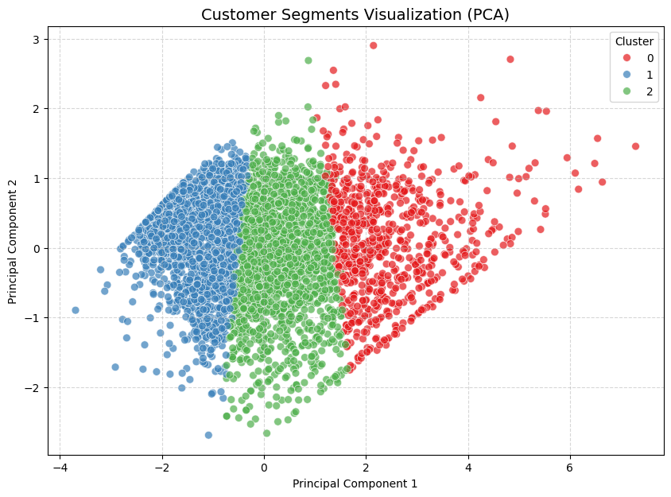

# Customer Segmentation with RFM & K-Means

A robust data science workflow to segment an online retail dataset containing **25,000+ transaction logs**. By combining the **RFM (Recency, Frequency, Monetary)** framework, mathematical data transformations, and **K-Means Clustering**, this project demonstrates how to translate raw transaction data into actionable commercial and marketing strategies.

---

### 💼 The Business Problem
When treating all customers the same way, marketing campaigns become highly inefficient and waste significant budget. To solve this, the marketing team needs a data-driven solution **to understand our typical customer profiles** so they can deliver more *targeted, relevant, and cost-effective marketing strategies.*

---

### 🛠️ Tech Stack & Methodology
* **Language:** Python
* **Data Engineering:** Pandas, NumPy (Log Transformation, Feature Engineering)
* **Machine Learning:** Scikit-Learn (`StandardScaler`, `KMeans`, `PCA`)
* **Visualization:** Matplotlib, Seaborn

---

### 📊 The Data Analytics Workflow
1. **Data Preprocessing:** Handled missing Customer IDs and eliminated transaction anomalies (negative quantities/prices). Created `TotalAmount` ($Quantity \times UnitPrice$).
2. **RFM Aggregation:** Calculated Recency (days since snapshot date), Frequency (total unique invoices), and Monetary (total spend) per customer.
3. **Log Transformation & Scaling:** Applied Log Transformation to handle right-skewness and utilized `StandardScaler` to normalize features for geometric clustering.
4. **Optimal K Selection:** Determined the ideal number of clusters ($K=3$) using the **Elbow Method**, while balancing mathematical variance with business feasibility.
5. **Dimensionality Reduction (PCA):** Projected the 3D RFM space into 2D via **Principal Component Analysis** for clear cluster validation.

---

### 📈 Final Segmentation & Insights

Based on our $K=3$ K-Means model, the customer base is segmented into three highly distinct behavioral groups:

| Cluster | Segment Name | Avg Recency | Avg Frequency | Avg Monetary | Operational Strategy |
| :---: | :--- | :---: | :---: | :---: | :--- |
| **0** | **Champions** | ~17 Days | ~13 Times | ~$7905 | Reward with VIP loyalty rewards, early access, and personalized VIP treatment. |
| **2** | **Potential / Loyalists** | ~44 Days | ~3.4 Times | ~$1265 | Cross-sell related product categories and offer product bundles. |
| **1** | **At-Risk / Hibernating**| ~167 Days | ~1.3 Times | ~$362 | Execute win-back marketing campaigns with limited-time discounts. |

---

### 🖼️ Cluster Visualization (PCA Projections)

To validate the clustering quality, the 3D RFM features were reduced to 2 Principal Components. The model yielded exceptionally clean separation boundaries:

